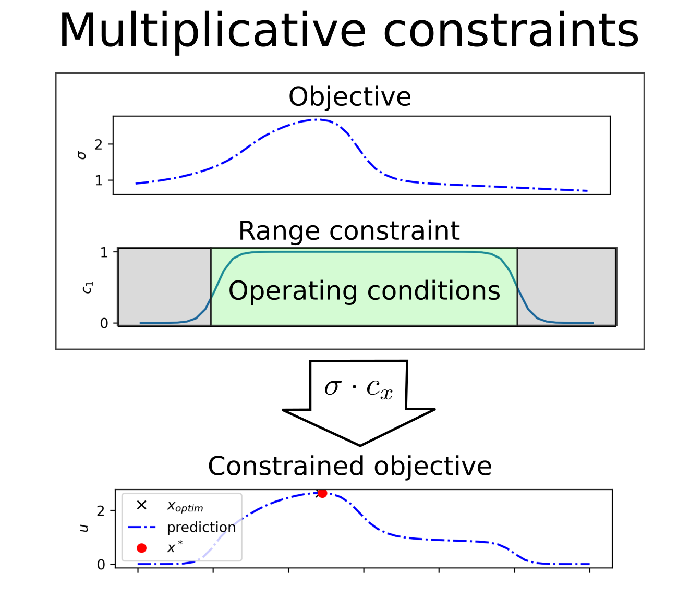

# Automated modeling and control of steady state engineering processes using deep active learning

## Abstract
Active learning is a form of machine learning where the model selects the next appropriate action. It has the potential to automate both modeling and control of systems/processes, yet it is underutilized in engineering application. This is likely due to its non-transparent (black box) and automated characteristics, reducing the trust of engineering practitioners. This work present the topic in a manner that is familiar to practitioners, namely as an optimization problem using geometric constraints. During exploration the operating conditions can fluctuate changing from one extreme value to the next. A constraint is developed to address this issue.

## Keywords
Bayesian optimization, active learning, data-based modeling, steady state 

# Introduction

Active learning is a form of reinforcement learning that places an emphasis on the cost of sample acquisition, where modern reinforcement learning emphasizes stringing together sequence of decisions to escape local minima. For example [1] investigated “The design of experiment using reinforcement learning” by having a car escaping a bowl by driving around to build up enough momentum and catapult out. In contrast, active learning finds its roots in mining [2] where rock samples are extracted by drilling deep and expensive wholes to find the optimum position for the mine. A large body of current work investigates active-learning for classification problems [3], by selecting the most informative samples to be labeled by a human oracle. According to [4] substantially less work considers regression.

This work investigates the use of active learning for control of industrial process. In this context it allows automated modeling and control of industrial processes. The authors anticipate that the adoption of this technique depends on the practitioner having confidence in the systems behavior. For this reason we present the systems behavior as an objective function constructed from a series of intuitive functions (constraints, transitions, exploration, and exploitation/control) which is more transparent but requires more design parameters.

This work also investigates a sampling constraint that limits extreme change of conditions between successive samples. This constraint is not applicable in simulation or clinical trials [5]–[7] but can affect efficiency and maintenance in engineering systems.

# Methodology

Running examples are used to illustrate the concepts here. Firstly a one dimensional problem presents how utility is constructed, using : (1) uncertainty sampling’s ability to reduce the number of trials, (2) range constraints to allow the practitioner to limit the systems operating conditions, and (3) a transition between exploration vs explorations using sigmoid functions.

A second multi-variate problem illustrates exploration constraints.

# Active learning

We present active-learning as a real-valued search problem. A system is sampled at particular operating conditions ( $y =f(x)+\eta$ ) . The data are used to train the model. Using the model the practitioner designs the acquisition function () to execute his/her intuition. The acquisition function is then searched to select the next sample. These acquisition functions are balance exploration and exploitation. Exploration considers acquiring informative samples, thereby efficiently modeling the system behavior and resembles optimal experimental design. Exploitation typically involves selecting samples that improve the current best, here we sampling at optimal conditions which resembles control.

