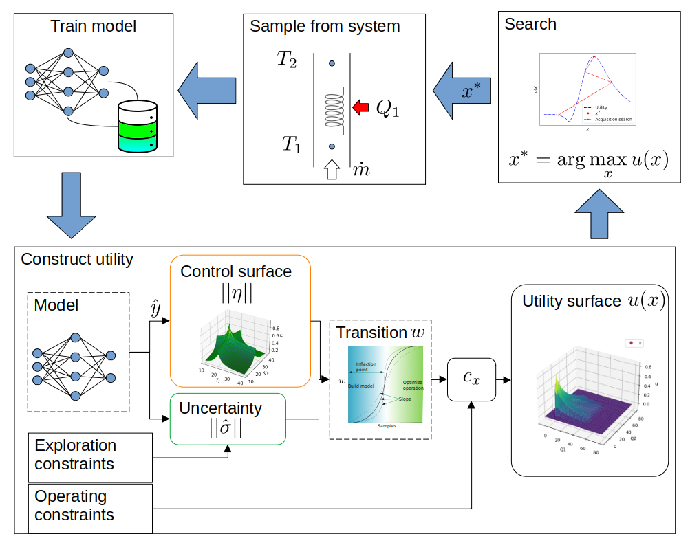
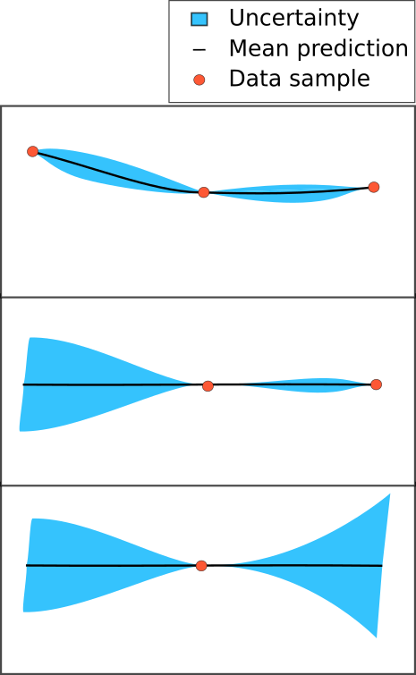

# Automated modeling and control of steady state engineering processes using deep active learning

## Abstract
Active learning is a form of machine learning where the model selects the next appropriate action. It has the potential to automate both modeling and control of systems/processes, yet it is underutilized in engineering application. This is likely due to its non-transparent (black box) and automated characteristics, reducing the trust of engineering practitioners. This work present the topic in a manner that is familiar to practitioners, namely as an optimization problem using geometric constraints. During exploration the operating conditions can fluctuate changing from one extreme value to the next. A constraint is developed to address this issue.

## Keywords
Bayesian optimization, active learning, data-based modeling, steady state 

# Introduction

Active learning is a form of reinforcement learning that places an emphasis on the cost of sample acquisition, where modern reinforcement learning emphasizes stringing together sequence of decisions to escape local minima. For example [1] investigated “The design of experiment using reinforcement learning” by having a car escaping a bowl by driving around to build up enough momentum and catapult out. In contrast, active learning finds its roots in mining [2] where rock samples are extracted by drilling deep and expensive wholes to find the optimum position for the mine. A large body of current work investigates active-learning for classification problems [3], by selecting the most informative samples to be labeled by a human oracle. According to [4] substantially less work considers regression.

This work investigates the use of active learning for control of industrial process. In this context it allows automated modeling and control of industrial processes. The authors anticipate that the adoption of this technique depends on the practitioner having confidence in the systems behavior. For this reason we present the systems behavior as an objective function constructed from a series of intuitive functions (constraints, transitions, exploration, and exploitation/control) which is more transparent but requires more design parameters.

This work also investigates a sampling constraint that limits extreme change of conditions between successive samples. This constraint is not applicable in simulation or clinical trials [5]–[7] but can affect efficiency and maintenance in engineering systems.

# Methodology

Running examples are used to illustrate the concepts here. Firstly a one dimensional problem presents how utility is constructed, using : (1) uncertainty sampling’s ability to reduce the number of trials, (2) range constraints to allow the practitioner to limit the systems operating conditions, and (3) a transition between exploration vs explorations using sigmoid functions.

A second multi-variate problem illustrates exploration constraints.

# Active learning

We present active-learning as a real-valued search problem. A system is sampled at particular operating conditions ( $y =f(x)+\epsilon$ ) . The data are used to train the model. Using the model the practitioner designs the acquisition function ( $u(x)$ ) to execute his/her intuition. The objective function, also referred to as acquisition or utility function is then searched to select the next sample. These acquisition functions are balance exploration and exploitation. Exploration considers acquiring informative samples, thereby efficiently modeling the system behavior and resembles optimal experimental design. Exploitation typically involves selecting samples that improve the current best, here we sampling at optimal conditions which resembles control.

Figure 1: Active learning involves constructing the utility function, searching it for the sample to acquire, then retraining the model.

This chapter looks at constructing the utility as an optimization search surface ( $u(x) \in R^1, x \in R^n$ ). It extends a more general form of Bayesian optimization ( ${u(x) = \eta + k\sigma}$) by providing explicit constraint terms as geometric functions. Where much of the previous work requires knowledge of Gaussian process regression, this work does not. 

## Uncertainty sampling

Bayesian optimization uses a model to automate experimental design. The intuition is to “measure at the point of highest uncertainty” and consequently highest information. This is referred to as uncertainty sampling or informative sampling.  

Figure 2: The intuition behind uncertainty sampling is "acquiring samples at the point of highest uncertainty will improve the model". 

Several modeling methods are able to predict the epistemic uncertainty (confidence interval) including Gaussian Process Regression, Ensemble, dropout, and Bayesian Neural Networks to name a few [8]–[12]. This work uses ensemble where multiple predictions quantify the mean and uncertainty ( $( \hat y,\sigma) = g(x)$ ).

# Multiplicative constraints

An issue that arises is that the sampling is not constrained  and may sample in undesirable states, far from our interest. Utility is introduced to accommodate constraints by quantifying the engineering practitioners requirements, desires, interests, etc. This can be thought of as a means of controlling or biasing the algorithms decision. 

Utility is the product of the uncertainty and the constraining function(s) ( $u(x) = \sigma(x) *c(x)$ ). The constraint is typically a step function ( $c(x) \in [0,1]$ ). The figure that follows illustrates this.

Figure 3: The construction of utility by the product of the uncertainty and constraint surfaces.

This acquisition function automates experimental design while respecting experimental constraints and has been shown to significantly reduce the number of experimental trials **[SELF REF]**. 

## Transition between exploration and exploitation

Once the model can predict the system response we would like to run the system at optimal conditions (control). We do this with the addition of an optimal response function ( $\eta$ ). The response is predicted by the model ( ${\eta(x) = h (\hat y})$ ) and so we require that the model predict the response correctly.

A term ( $w$ ) is introduce to quantify “the expected change in the model from the next sample”. When  is low, there is little benefit in exploration, and exploitation/optimization can take precedence. 

Figure 4: Using a sigmoid as a transition function, the inflection point and slope will affect the transition between acquiring data to build the model (exploration) and controlling or optimizing the operation (exploitation).

The practitioner is responsible for designing the  transition function using a sigmoid, ( ${w(z) \in (0,1)}$ ) . The utility is modified accordingly ( ${u(x) = c_x(x)[w*{\sigma (x)} +(1-w){\eta(x)}] }$ ). Several other forms are available in literature but are not as transparent [13]–[15], requiring deep knowledge of stochastic processes.

Selecting to maximize the response ( ${\eta(x) = \hat y}$ ) the algorithm will now first explore to model the behavior, then optimize the operating conditions. The figure that follows illustrates the process but the process is better illustrated using the supplementary GIF..
